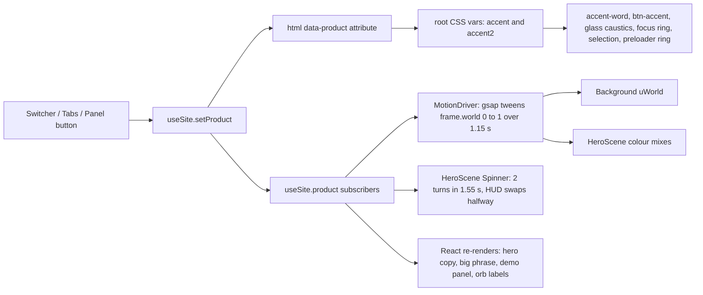

---
tags:
  - selika
  - web-dev
  - design
  - react
type: reference
status: active
date: 2026-10-09
source: selika site v8 source (branch v8-overhaul, final build 8.9), Projects/Selika Site/selika 8.9
key: The technical blueprint of the Selika v8 site, covering exact dependency versions, Vite/TS/Tailwind config, index.html head, every file's job, the single-clock runtime (GSAP ticker driving Lenis, R3F and DOM), stores, perf tiers, fallbacks, accessibility and how the Beauty/Dev switch propagates. Read it before rebuilding, upgrading or debugging the site.
---

# Selika Site v8 - Architecture and Stack

> [!abstract] Key
> The technical blueprint of the Selika v8 site, covering exact dependency versions, Vite/TS/Tailwind config, index.html head, every file's job, the single-clock runtime (GSAP ticker driving Lenis, R3F and DOM), stores, perf tiers, fallbacks, accessibility and how the Beauty/Dev switch propagates. Read it before rebuilding, upgrading or debugging the site.

**Related:** [[Selika Site v8 - Build Bible]] | [[Selika Site v8 - Design System]] | [[Selika Site v8 - Sections and Copy]] | [[Selika Site v8 - Hero and Mirror Scene]] | [[Selika Site v8 - Aurora Background]] | [[Selika Site v8 - Interactive Demo]] | [[Selika Site v8 - Assets and Provenance]] | [[Selika]]

---

## 1. Snapshot of the source

| Item | Value |
| --- | --- |
| Repo | `/home/claude/selika`, branch `v8-overhaul` (a `main` branch also exists) |
| Final build | 8.9 (the commit that adds the search and app icons, `docs/` and `tools/qa/`, on top of `d5ffbca`) |
| `package.json` name / version | `selika` / `8.0.0`, `"private": true`, `"type": "module"` |
| Node used for the build here | v22.22.2 |
| Lockfile | `package-lock.json`, `lockfileVersion` 3 |
| Hosting | Static site on Vercel (`vercel.json`) |
| Backend | None |

Scripts (`package.json`):

```json
"dev": "vite",
"build": "tsc -b && vite build",
"preview": "vite preview"
```

Testing aid (`src/lib/perf.ts`): `?tier=low`, `?tier=mid` or `?tier=high` in the URL forces a performance tier. Development only (`src/sections/demo/facePacks.ts`): `?faces=a,b` loads face packs that are not listed yet.

## 2. Dependencies (exact)

Versions are as pinned in `package.json`; where the spec uses a caret, the resolved version from `package-lock.json` is given too.

### Runtime

| Package | package.json | Resolved | Used for |
| --- | --- | --- | --- |
| `react` | 19.3.0 | 19.3.0 | UI |
| `react-dom` | 19.3.0 | 19.3.0 | UI, `flushSync` in `DevLayer.tsx` |
| `three` | 0.186.1 | 0.186.1 | 3D (hero mirror, ICT face fallback) |
| `@react-three/fiber` | 9.8.1 | 9.8.1 | React renderer for three (`Canvas`, `useFrame`, `useThree`) |
| `@react-three/drei` | 10.7.9 | 10.7.9 | `Environment`, `Lightformer`, `useGLTF` |
| `gsap` | 3.15.0 | 3.15.0 | The shared ticker, tweens, timelines |
| `lenis` | 1.3.26 | 1.3.26 | Smooth scroll (`lenis/react`), plus `lenis/dist/lenis.css` |
| `motion` | 14.0.0 | 14.0.0 (pulls `framer-motion` 14.0.0, `motion-dom` 14.0.0) | React animation (`motion/react`) |
| `zustand` | 5.0.15 | 5.0.15 | Stores |
| `lucide` | ^0.453.0 | 0.453.0 | Icon data (vanilla package, not `lucide-react`) |
| `thinking-orbs` | 0.3.2 | 0.3.2 | `ThinkingOrb` loading/voice indicator |
| `@fontsource-variable/outfit` | ^5.3.0 | 5.3.0 | Display face |
| `@fontsource-variable/plus-jakarta-sans` | 5.3.0 | 5.3.0 | Body face |
| `@fontsource/instrument-serif` | 5.3.0 | 5.3.0 | Italic accent word |
| `@fontsource/geist-mono` | 5.3.0 | 5.3.0 | Mono labels, code |

Transitive packages that matter for chunking: `three-stdlib` 2.36.1 and `@monogrid/gainmap-js` 3.4.0 (both pulled in by drei, both routed to the `three` chunk).

### Dev

| Package | package.json | Resolved |
| --- | --- | --- |
| `vite` | 5.4.21 | 5.4.21 (esbuild 0.21.5, rollup 4.64.0) |
| `@vitejs/plugin-react` | 4.7.0 | 4.7.0 |
| `typescript` | 5.9.3 | 5.9.3 |
| `tailwindcss` | ^3.4.19 | 3.4.19 |
| `postcss` | ^8.5.28 | 8.5.29 |
| `autoprefixer` | ^10.6.0 | 10.6.1 |
| `@types/react` / `@types/react-dom` | 19.3.0 | 19.3.0 |
| `@types/three` | 0.186.0 | 0.186.0 |
| `@types/node` | 22.20.5 | 22.20.5 |

Licences are listed in `THIRD_PARTY_NOTICES.md` (MIT for most; lucide ISC; gsap under the GSAP Standard "no charge" licence; fonts SIL OFL 1.1; ICT-FaceKit MIT).

## 3. Build configuration

### vite.config.ts (verbatim)

```ts
import { defineConfig } from "vite";
import react from "@vitejs/plugin-react";
import { createHash } from "node:crypto";
import { readdirSync, readFileSync, statSync } from "node:fs";
import { join, relative } from "node:path";

/* a short hash of every file in public/, keyed by its URL path; src/lib/pub.ts puts it on the end of
   each address, so an updated photo or video can never come from a stale cache */
function publicVersions(dir = "public") {
  const out: Record<string, string> = {};
  const walk = (d: string) => {
    for (const name of readdirSync(d)) {
      const p = join(d, name);
      if (statSync(p).isDirectory()) walk(p);
      else out["/" + relative(dir, p).split("\\").join("/")] = createHash("sha1").update(readFileSync(p)).digest("hex").slice(0, 8);
    }
  };
  walk(dir);
  return out;
}

export default defineConfig({
  plugins: [react()],
  define: { __PUBLIC_V__: JSON.stringify(publicVersions()) },
  build: {
    target: "es2020",
    sourcemap: false,
    // three.js and React Three Fiber load on their own, only once the hero or the demo needs them
    rollupOptions: {
      output: {
        manualChunks(id) {
          // the 3D libraries in one lazy chunk; every other package in "vendor", so nothing the page needs
          // up front gets folded into the 3D chunk (which would then load immediately)
          if (/node_modules\/(three|three-stdlib|@react-three|@monogrid)\//.test(id)) return "three";
          if (id.includes("node_modules") || id.includes("vite/preload-helper") || id.includes("commonjsHelpers")) return "vendor";
        },
      },
    },
    chunkSizeWarningLimit: 1100,
  },
});
```

What it does:

- `publicVersions()` walks `public/` at config time, SHA-1 hashes every file and keeps the first 8 hex chars, keyed by URL path (for example `"/visuals/holo.mp4": "xxxxxxxx"`). The map is injected as the global constant `__PUBLIC_V__`.
- `manualChunks` produces exactly three named chunk groups: `three` (three, three-stdlib, @react-three/*, @monogrid/*), `vendor` (every other node_module plus Vite's preload helper and commonjs helpers) and the app chunks. Keeping preload helpers in `vendor` stops Rollup from folding them into `three`, which would force the 3D chunk to load eagerly.
- `chunkSizeWarningLimit: 1100` (kB) because the `three` chunk is about 1.04 MB.

Build output observed in `dist/assets` (build 8.9): `index-*.js` 136,194 B, `index-*.css` 95,462 B, `vendor-*.js` 509,640 B, `three-*.js` 1,042,770 B, `HeroScene-*.js` 30,825 B, `FaceScene-*.js` 19,334 B, `PhotoFace-*.js` 14,793 B, plus Geist Mono woff/woff2 subsets (and the Outfit, Plus Jakarta Sans, Instrument Serif files). `dist/index.html` gets `<script type="module" crossorigin src="/assets/index-*.js">`, a `modulepreload` for `vendor`, and the CSS link.

### src/lib/pub.ts (verbatim)

```ts
/* Files in public/ keep their plain names, so a browser or CDN that cached an earlier copy could keep
   showing it after an update. Each one is addressed with a short hash of its contents instead
   (worked out in vite.config.ts), so a changed photo or video always loads fresh and an unchanged
   one stays cached. */
declare const __PUBLIC_V__: Record<string, string>;

export const pub = (path: string) => {
  const v = __PUBLIC_V__[path];
  return v ? `${path}?v=${v}` : path;
};
```

Every runtime reference to a `public/` file goes through `pub()`: `HOLO_SRC` / `HOLO_POSTER` in `src/gl/HeroScene.tsx`, the concept images in `src/sections/TwoProducts.tsx`, the tile portraits in `src/sections/OnlyMirrorArt.tsx`, `facePath()` in `src/sections/demo/facePacks.ts`, and the GLB path in `FaceScene.tsx`. Icons and the manifest in `index.html` are not versioned.

### tsconfig.json (verbatim)

```json
{
  "compilerOptions": {
    "target": "ES2020",
    "lib": ["ES2020", "DOM", "DOM.Iterable"],
    "module": "ESNext",
    "moduleResolution": "bundler",
    "jsx": "react-jsx",
    "strict": true,
    "skipLibCheck": true,
    "noEmit": true,
    "isolatedModules": true,
    "resolveJsonModule": true,
    "allowImportingTsExtensions": true,
    "noUnusedLocals": false,
    "noUnusedParameters": false
  },
  "include": ["src", "vite.config.ts"]
}
```

`resolveJsonModule` is needed for `src/sections/demo/landmarks.json`. `src/vite-env.d.ts` is the single line `/// <reference types="vite/client" />` (gives `import.meta.env.DEV`).

### PostCSS and Tailwind

`postcss.config.js`: `export default { plugins: { tailwindcss: {}, autoprefixer: {} } };`

`tailwind.config.js`: content `["./index.html", "./src/**/*.{ts,tsx}"]`, `future: { hoverOnlyWhenSupported: true }` (so every Tailwind `hover:` variant is wrapped in `@media (hover: hover)`), extended colours, four font families, `borderRadius` `4xl` 2rem and `5xl` 2.5rem, and two timing functions (`out-expo`, `in-out-quart`). No plugins. Full values are in [[Selika Site v8 - Design System]].

### vercel.json

- Rewrite `/(.*)` to `/index.html` (SPA fallback).
- `Cache-Control: public, max-age=31536000, immutable` for `/assets/(.*)` (hashed bundles).
- `Cache-Control: public, max-age=86400` for `/models/(.*)` and `/faces/(.*)`.

`.gitignore`: `node_modules`, `dist`, `.DS_Store`, `*.log`, `.vercel`, `__pycache__`.

## 4. index.html head

```html
<meta charset="UTF-8" />
<meta name="viewport" content="width=device-width, initial-scale=1.0, viewport-fit=cover" />
<meta name="description" content="Selika is one mirror platform with two products: Selika Beauty guides your makeup step by step on your own reflection, and Selika Dev opens the same mirror to developers and makers." />
<meta property="og:title" content="selika: one mirror, two products" />
<meta property="og:description" content="Selika Beauty guides makeup on your own reflection, in light you control. Selika Dev opens the mirror to developers." />
<meta property="og:type" content="website" />
<meta property="og:url" content="https://selika.site" />
<meta name="theme-color" content="#05060A" />
<!-- icons: Google's search results use a square icon of at least 48 px; /favicon.ico is the fallback it also looks for -->
<link rel="icon" href="/favicon.ico" sizes="48x48" />
<link rel="icon" type="image/png" sizes="192x192" href="/icon-192.png" />
<link rel="icon" type="image/svg+xml" href="/favicon.svg" />
<link rel="apple-touch-icon" href="/apple-touch-icon.png" />
<link rel="manifest" href="/site.webmanifest" />
<script type="application/ld+json">{"@context":"https://schema.org","@type":"Organization","name":"selika","url":"https://selika.site/","logo":"https://selika.site/icon-512.png"}</script>
<title>selika</title>
```

Body: `<div id="root"></div>`, a `<noscript>` paragraph (`font-family:system-ui;color:#eef2ff;padding:2rem`) saying the site needs JavaScript for its demo, and `<script type="module" src="/src/main.tsx">`. `viewport-fit=cover` is what makes `env(safe-area-inset-bottom)` work for the mobile switcher in `Hero.tsx`.

`public/site.webmanifest`: name and short_name `selika`, icons 192 and 512 PNG, `theme_color` and `background_color` `#05060A`, `display: standalone`, `start_url: /`. Icon details are in [[Selika Site v8 - Design System]].

## 5. Folder tree

```
selika/
  index.html                 document head (SEO, icons, manifest, JSON-LD), root div, noscript
  package.json               scripts and pinned dependencies
  package-lock.json          resolved tree (lockfileVersion 3)
  vite.config.ts             React plugin, __PUBLIC_V__ content-hash map, manualChunks (three / vendor)
  tsconfig.json              strict TS, bundler resolution, JSON imports
  tailwind.config.js         colour tokens, font families, radii, easings, hoverOnlyWhenSupported
  postcss.config.js          tailwindcss + autoprefixer
  vercel.json                SPA rewrite and cache headers
  README.md                  run, deploy, structure, face-pack workflow, notes
  THIRD_PARTY_NOTICES.md     licences for ICT-FaceKit, packages, fonts; Kokonut UI design reference
  .gitignore                 build and tooling ignores
  tools/
    build_face_pack.py       portrait (+ eyes-closed copy) to 4:5 face pack: photo, closed, depth, thumb, landmarks (mediapipe, cv2)
    ict2glb.py               ICT-FaceKit OBJ + expression shapes to compact public/models/face.glb (cm to m)
    objread.py               minimal OBJ reader used by ict2glb.py
  public/
    favicon.svg              512 viewBox glow mark on a radial night gradient
    favicon.ico              16, 32 and 48 px PNG-in-ICO
    icon-192.png             192 x 192 PNG (manifest, rel=icon)
    icon-512.png             512 x 512 PNG (manifest, JSON-LD logo)
    apple-touch-icon.png     180 x 180 PNG
    site.webmanifest         PWA manifest
    models/face.glb          ICT-FaceKit head (1,103,600 B), the demo's fallback face
    faces/face-{fair,medium,warm,deep}{.jpg,-closed.jpg,-depth.png,-thumb.jpg,.json}   photographic face packs
    visuals/holo.mp4, holo.jpg            hero hologram loop and poster
    visuals/concept-beauty.webp, concept-dev.webp   product panel concept images
    visuals/reflect.webp, light.webp, return.webp   "only a mirror" tile portraits
  src/
    main.tsx                 sets <html data-product="beauty">, mounts <App/> in StrictMode, imports index.css
    App.tsx                  page composition and section order
    index.css                fonts, Tailwind layers, tokens, glass materials, motion and component CSS
    vite-env.d.ts            Vite client types
    components/
      ui.tsx                 GlassFilters, specMove, Mark, Logo, Headline, Eyebrow, Reveal, Button, FlipCard, Reactive, Chip, Section, SceneBoundary
      Nav.tsx                fixed header: logo pill, section pills with sliding thumb, CTA, mobile menu dialog
      Preloader.tsx          percentage ring that morphs into the hero mirror's outline, then hands over
    lib/
      motion.tsx             MotionDriver: the one clock (gsap.ticker) driving Lenis and all addTick callbacks; useTick, scrollToTarget
      frame.ts               mutable per-frame state outside React (pointer, scroll, world, hero, heroBox, viewport)
      perf.ts                isCoarse / isNarrow / reducedMotion, tiers, runtime downgrade, bgScale, dprFor, supportsRefraction
      store.ts               useSite zustand store (product, switchCount, switching, entered)
      content.ts             every line of copy (PRODUCTS, NAV, PROBLEM, ONLY_MIRROR, TWO, COMPARE, INSIDE, PRIVACY, ROADMAP, ABOUT, FOOTER)
      icons.tsx              Lucide icon set as React <Icon>, as SVG strings, and as a canvas atlas for WebGL
      physics.ts             kelvinToRGB, hex, triple, clamp, lerp, project, rubberband, springFor
      environments.ts        lighting environments in mired space (not imported anywhere in v8)
      hooks.ts               useMediaQuery, useReducedMotion, useIsDesktop (not imported anywhere in v8)
      pub.ts                 content-hash suffix for public/ URLs
    gl/
      Background.tsx         fixed full-screen raw-WebGL canvas for the aurora/field shader, driven by addTick
      backgroundShader.ts    BG_VERT / BG_FRAG (GLSL ES 1.0, simplex noise, aurora zigzag, grain)
      HeroScene.tsx          R3F hero: mirror, HUD textures, hologram video, dissolve points, 14 orbs, spin, camera rig
      shaders.ts             hero GLSL: glass, halo, orb, icon, spark, pane, hologram video, burst
      hud.ts                 2D canvas drawings for the mirror glass (Beauty HUD, Dev HUD, Dev panes), HUD fonts
      heroBridge.ts          shared hero geometry between WebGL and DOM: orbScreen, mirrorRect, avoidRects, hitsMirror, useHeroUI, MIRROR, ORBS_*
    sections/
      Hero.tsx               sticky hero, copy, product switcher (desktop cards / mobile segmented), orb labels and cards, big phrase, dive
      Problem.tsx            Problem (three flip cards) and OnlyMirror (three tilt cards)
      OnlyMirrorArt.tsx      CSS-animated art for the three "only a mirror" tiles (ReflectArt, LightArt, ReturnArt)
      TwoProducts.tsx        two product panels with concept images, "One core" badge, scroll-lit statement
      Compare.tsx            comparison table (cards on phones)
      Inside.tsx             hardware layers: scroll-driven exploded stack (desktop) or stacked list, plus stats
      Privacy.tsx            interactive camera shutter module and privacy points
      Roadmap.tsx            Roadmap, About and Footer
      demo/
        DemoSection.tsx      demo header, product tabs, mirror frame (lazy face), side panel, disclaimer
        Panels.tsx           BeautyPanel and DevPanel (segmented drawers, steps, toggles, illustrative code)
        AskPill.tsx          voice-prompt pill with ThinkingOrb and Selika's replies
        DevLayer.tsx         draggable Dev modules on the glass, camera indicator
        FaceScene.tsx        R3F ICT-FaceKit head with painted makeup and guides (fallback when no packs)
        PhotoFace.tsx        single-pass raw-WebGL photographic face (default, since packs exist)
        facePacks.ts         FACE_PACKS list (fair, medium, warm, deep) and facePath()
        photoMakeup.ts       makeup and guide painting in photo space from landmarks
        makeup.ts            makeup and guide painting in ICT UV space
        hair.ts              shader-patch hair for the bald ICT head
        state.ts             useDemo store, LIGHTS, LOOKS, TONES, STEPS, MODULES
        landmarks.json       ICT-FaceKit UV landmarks (68-point layout) for makeup.ts
```

## 6. Runtime model

### 6.1 Boot (`src/main.tsx`)

```tsx
document.documentElement.dataset.product = "beauty";
createRoot(document.getElementById("root")!).render(<StrictMode><App /></StrictMode>);
```

`index.css` is imported here, which also pulls in the fonts and `lenis/dist/lenis.css`.

### 6.2 Composition and section order (`src/App.tsx`)

Top-level siblings, in order:

1. `<MotionDriver />` (clock, Lenis, pointer)
2. `<GlassFilters />` (hidden SVG filter defs, adds `html.sg-refract` on Chromium desktop)
3. `<Background />` (fixed aurora canvas at `-z-10`)
4. `<Preloader />` (fixed overlay at `z-[60]`)
5. Skip link: `<a href="#demo" className="sr-only focus:not-sr-only focus:fixed focus:left-4 focus:top-4 focus:z-[70] focus:rounded-full focus:bg-white focus:px-4 focus:py-2 focus:text-night">Skip to the demo</a>`
6. `<Nav />` (fixed header `z-40`)
7. `<main>`: `Hero`, `Problem`, `DemoSection`, `OnlyMirror`, `TwoProducts`, `Compare`, `Inside`, `Privacy`, `Roadmap`, `About`
8. `<Footer />`

Section ids used by navigation: `#top` (hero wrapper), `#problem`, `#demo`, `#products`, `#inside`, `#privacy`, `#roadmap`, `#about`. `NAV` in `content.ts` links Products, Demo, Hardware (`#inside`), Privacy, Roadmap. `OnlyMirror` and `Compare` have no id.

### 6.3 Lazy loading

| What | How | When |
| --- | --- | --- |
| `HeroScene` | `lazy(() => import("../gl/HeroScene"))` in `Hero.tsx`, inside `<SceneBoundary><Suspense fallback={null}>` | Immediately, and the Preloader also calls `import("../gl/HeroScene")` so the 3D chunk is fetched while the count runs |
| `FaceScene` / `PhotoFace` | `lazy()` in `DemoSection.tsx` | Only after an IntersectionObserver with `rootMargin: "150% 0px"` reports the mirror is near; before that a `ThinkingOrb state="searching" size={64}` placeholder shows |
| `three` chunk | `manualChunks` | Pulled in by whichever of the above loads first |
| Images | `loading="lazy" decoding="async"` on concept, tile and thumbnail images | Native |
| `face.glb` | `useGLTF.preload(MODEL, false, true)` at module scope of `FaceScene.tsx` | Only when that chunk loads (it does not while face packs exist, because `PHOTO = FACE_PACKS.length > 0` selects `PhotoFace`) |

### 6.4 The one clock (`src/lib/motion.tsx`)

Comment in source: "One clock. GSAP's ticker runs first (its own tweens), then Lenis, then every registered per-frame callback (the background shader, the 3D scenes, DOM effects). Nothing on the page runs its own requestAnimationFrame." (Exceptions in practice: the Preloader's own rAF loop before the page is entered, and one rAF in `DevLayer` to enable a glide class.)

```ts
type Tick = (t: number, dt: number) => void;
const ticks = new Set<Tick>();
export function addTick(fn: Tick) { ticks.add(fn); return () => { ticks.delete(fn); }; }
export function useTick(fn: Tick, active = true) { /* ref-wrapped addTick inside useEffect */ }

const LENIS_OPTIONS = { autoRaf: false, lerp: 0.1, smoothWheel: true, syncTouch: false, anchors: true, stopInertiaOnNavigate: true } as const;
```

`MotionDriver` renders `<ReactLenis root options={LENIS_OPTIONS} ref={lenisRef} />` and `<ScrollBridge />`, and in one effect:

- Adds passive `pointermove` and `pointerdown` listeners writing `frame.pointer`: raw `x, y`; targets `tx = clientX/w*2-1`, `ty = -(clientY/h*2-1)`; velocity `vx, vy` blended at 0.3 per event (viewport widths per second, `dtm` floored at 8 ms); `seen = true`; `touch = pointerType === "touch"`.
- Adds a passive `resize` listener updating `frame.vw`, `frame.vh`.
- Subscribes to `useSite`: when `product` changes, sets `frame.worldTarget` (dev 1, beauty 0) and `gsap.to(frame, { world, duration: reducedMotion ? 0.01 : 1.15, ease: "power2.inOut", overwrite: true })`.
- Registers `tick` on `gsap.ticker` and calls `gsap.ticker.lagSmoothing(0)`.

Per frame (`tick(time)`):

1. `dt = min(0.05, real elapsed seconds)`; `reportFrame(dt * 1000)` for tier downgrade.
2. `frame.time = time; frame.dt = dt`.
3. Pointer smoothing: `k = 1 - exp(-dt * 7.5)`, `nx += (tx - nx) * k`, same for `ny`; velocity decays by `exp(-dt * 3)`.
4. `lenisRef.current?.lenis?.raf(time * 1000)` (Lenis has `autoRaf: false`); if Lenis is absent, `frame.scroll.y = window.scrollY`.
5. `frame.scroll.v *= exp(-dt * 4)`.
6. Every registered tick: `ticks.forEach((fn) => fn(time, dt))`.

`ScrollBridge` uses `useLenis((l) => ...)` to set `frame.scroll.y = l.scroll` and blend `frame.scroll.v` toward `(l.velocity / vh) * 60` at 0.2.

`scrollToTarget(target, lenis?)` (exported, not used by v8 components) scrolls with duration 1.4 and easing `1 - (1 - t)^4`, falling back to native smooth scroll. Components call `lenis.scrollTo(...)` directly (durations 1.5 to 2 s; see the Design System note).

### 6.5 Per-frame state (`src/lib/frame.ts`)

A plain mutable object, never React state:

| Field | Meaning |
| --- | --- |
| `time`, `dt` | ticker time (s) and clamped delta |
| `pointer.x, y` | raw CSS px |
| `pointer.nx, ny` | smoothed -1..1, y up |
| `pointer.tx, ty` | raw target -1..1, y up |
| `pointer.vx, vy` | smoothed velocity, viewport widths per second |
| `pointer.seen`, `pointer.touch` | has moved yet; last input was touch |
| `scroll.y`, `scroll.v` | document scroll px; smoothed velocity in viewport heights per second |
| `world`, `worldTarget` | 0 Beauty, 1 Dev, eased by GSAP |
| `hero` | 0..1 progress of the hero dive (set by `Hero.tsx`) |
| `heroBox.top/bottom` | on portrait screens, the free band between hero copy and switcher |
| `vw`, `vh` | viewport size (defaults 1440 x 900 without window) |

### 6.6 Performance tiers (`src/lib/perf.ts`)

```ts
export const isCoarse = window.matchMedia("(pointer: coarse)").matches;
export const isNarrow = window.innerWidth < 768;
export const reducedMotion = window.matchMedia("(prefers-reduced-motion: reduce)").matches;
```

All three are evaluated once at module load (they do not react to later changes).

Initial tier:

- `?tier=` override wins.
- `cores = navigator.hardwareConcurrency ?? 4`, `mem = navigator.deviceMemory ?? 4`.
- Coarse or narrow: `cores >= 8 && mem >= 6` gives `mid`, otherwise `low`.
- Otherwise: `cores >= 8 && mem >= 8` gives `high`, otherwise `mid`.

Runtime downgrade (`reportFrame(ms)`): ignored while `document.hidden`. Counts frames over 26 ms. Every 120 samples, if more than 45% were slow and tier is not `low`, steps down one level (high to mid, mid to low) and notifies `onTier` listeners; counters reset each window. Tiers never step back up.

Helpers:

| Helper | high | mid | low |
| --- | --- | --- | --- |
| `bgScale(t)` (background resolution scale) | 0.72 | 0.55 | 0.4 |
| `dprFor(t)` (R3F `dpr` range) | [1, 1.75] | [1, 1.4] | [0.8, 1.15] |
| Background `uOct` noise octaves (`Background.tsx`) | 5 | 4 | 3 |
| Hero dissolve points (`HeroScene.tsx`) | 9500 | 7000 | 3600 |
| R3F `antialias` | true | true | false |
| ICT face guide texture | 1024 (`TEX`) | 1024 | 512; lash texture 512 / 256 |
| ICT face repaint rate | 30 fps | 24 fps | 12 fps |
| PhotoFace guide canvas | 768 x 960 | 768 x 960 | 512 x 640; DPR cap 2 (1.25 on low); draws at most 30 fps on low |

`supportsRefraction = "userAgentData" in navigator && !isCoarse` (a Chromium sniff, desktop only) gates the SVG lens backdrop filters.

Only `Background.tsx` subscribes to `onTier` (it re-scales and re-sets octaves live). The R3F canvases and PhotoFace read `getTier()` once when they mount.

### 6.7 Stores

**`useSite`** (`src/lib/store.ts`, zustand 5):

| Field / action | Behaviour |
| --- | --- |
| `product: "beauty" \| "dev"` | starts `"beauty"` |
| `switchCount` | increments on every switch (not read by any v8 component) |
| `switching` | true for 1250 ms after a switch (timer), then false (not read by any v8 component) |
| `entered` | false until the Preloader calls `enter()` |
| `setProduct(p)` | no-op if unchanged; otherwise writes `document.documentElement.dataset.product = p`, bumps `switchCount`, sets `switching`, restarts the 1250 ms timer |
| `toggleProduct()` | flips beauty and dev |
| `enter()` | `entered: true` |

**`useHeroUI`** (`src/gl/heroBridge.ts`): `hovered` and `selected` orb indices (both -1 by default) with setters. Written by orb pointer events in `HeroScene.tsx` and `onPointerMissed`; read by `OrbOverlay` in `Hero.tsx`.

**`useDemo`** (`src/sections/demo/state.ts`): `step` 0, `look` "office", `light` "selika", `tone` 1, `face` 2 (Warm), `hover` null, `smile` 0, `reply` null, `moved` false; Dev: `on` (all modules on, except `build` and `home` off when `innerWidth < 640`), `perms` (per module: camera always false; mic, calendar, network true if the module needs them), `selected` "agent", `model` "device", `pos` (2-column grid at x 0.05 / 0.51, y 0.075 / 0.325 / 0.575). Actions `set(partial)` and `say(text)` (sets `reply` with an incrementing id). Constants `LIGHTS`, `LOOKS`, `TONES`, `STEPS`, `MODULES` live alongside. Details in [[Selika Site v8 - Interactive Demo]].

### 6.8 Hero bridge (`src/gl/heroBridge.ts`)

Plain mutable arrays and objects shared between the R3F scene (writer) and DOM overlay (reader), without React:

- `orbScreen`: 14 entries `{ x, y, r, alpha, z }` (7 Beauty orbs then 7 Dev orbs), written every frame by the scene.
- `mirrorRect`: `{ x0, y0, x1, y1, q }`, `q` being the glass's 4 projected corners as 8 numbers in the order bottom-left, bottom-right, top-right, top-left.
- `avoidRects`: rects of hero copy, switcher and phrase (`[data-avoid]` elements), refreshed by `OrbOverlay` each frame while `frame.hero < 0.3`.
- `hitsMirror(rect, pad = 4)`: separating-axis test of a screen rect against the projected glass quad.
- `MIRROR = { w: 1.05, h: 1.75, bezel: 0.046, corner: 0.15, depth: 0.03, bevel: 0.012 }` (world units).
- `ORBS_WIDE` and `ORBS_TALL`: 7 orb positions and radii relative to the mirror centre for landscape and portrait.
- In dev builds, exposes `window.__hero`.

The Preloader reads `mirrorRect` to morph its ring into the real mirror outline. `BigPhrase` reads `mirrorRect.q` to hug the glass. Full detail: [[Selika Site v8 - Hero and Mirror Scene]].

### 6.9 R3F rendering model

Both R3F canvases use `frameloop="never"` and a `Driver` component:

```tsx
function Driver({ active }: { active: boolean }) {
  const advance = useThree((s) => s.advance);
  useEffect(() => {
    if (!active) return;
    return addTick((t) => advance(t));
  }, [active, advance]);
  return null;
}
```

So R3F renders only when the shared ticker calls `advance`, and only while `active`:

- Hero: `active` is an IntersectionObserver on the hero wrapper with `rootMargin: "100px"`.
- Demo face: `active` is `visible`, an IntersectionObserver on the mirror with `rootMargin: "80px 0px"`.

Hero canvas: `dpr={dprFor(tier)}`, `gl={{ antialias: tier !== "low", alpha: true, powerPreference: "high-performance" }}`, camera `fov 30`, position `[0, 0, 4.35]`, near 0.05, far 40, `style={{ position: "absolute", inset: 0 }}`, `onPointerMissed` clears `selected`. Environment `resolution={128} frames={1}` with four Lightformers.

ICT face canvas: same `dpr`/`gl`, camera `fov 21`, position `[0, 0.024, 0.76]`, near 0.01, far 10; Environment `resolution={64} frames={1}`.

Raw WebGL (no R3F) is used for `Background.tsx` and `PhotoFace.tsx`, each drawing one full-screen triangle (`[-1,-1, 3,-1, -1,3]`) inside an `addTick` callback.

`Background.tsx` specifics: context `{ antialias: false, alpha: false, depth: false, stencil: false, powerPreference: "high-performance", preserveDrawingBuffer: false }`; canvas size `innerWidth * s` where `s = min(bgScale(tier), 1600 / innerWidth)`; skipped while `document.hidden`; under reduced motion `drift` stops and a frame is only drawn when a key built from scroll, world and hero changes. The canvas is `pointer-events-none fixed inset-0 -z-10 h-[100lvh] w-full opacity-0 transition-opacity duration-1000` and set to opacity 1 once the program links. Shader detail: [[Selika Site v8 - Aurora Background]].

### 6.10 Other lib modules

- **`src/lib/hooks.ts`**: `useMediaQuery(query)`, `useReducedMotion()` (`(prefers-reduced-motion: reduce)`), `useIsDesktop()` (`(min-width: 1024px)`). Present but not imported by any v8 file.
- **`src/lib/environments.ts`**: `ENVS` (Candlelit 1900 K, Nightlife 2400 K, Restaurant 3000 K, Office 4000 K, Daylight 6500 K), `BASELINE` (bathroom 5000 K), mired helpers `kToT`, `tToK`, `TRACK_ORDER`, `DEFAULT_ENV`, `sampleAt`, `nearestEnv`. Not imported by any v8 file (left from an earlier lighting simulator).
- **`src/lib/physics.ts`**:
  - `kelvinToRGB(k)`: the standard black-body approximation. Clamps K to 1000..12000, `t = K/100`. If `t <= 66`: `r = 255`, `g = 99.4708025861 ln t - 161.1195681661`; else `r = 329.698727446 (t-60)^-0.1332047592`, `g = 288.1221695283 (t-60)^-0.0755148492`. Blue: 255 if `t >= 66`, 0 if `t <= 19`, else `138.5177312231 ln(t-10) - 305.0447927307`. Each channel clamped 0..255 and rounded. Used by `Panels.tsx` (light swatches), `FaceScene.tsx` and `PhotoFace.tsx` (key light colour).
  - `hex(rgb)`, `triple(rgb)` (`"r g b"`), `clamp`, `lerp`.
  - `project(velocity, decelerationRate = 0.995)`, `rubberband(overshoot, dimension = 1, constant = 0.55)`, `springFor(response, dampingRatio)` (Apple-style response/damping to stiffness/damping). Not used in v8 (the `.project(` calls in `HeroScene.tsx` are three.js `Vector3.project`).
- **`src/lib/icons.tsx`**: imports 53 named icons from vanilla `lucide` into one `ICONS` map. `Icon({ name, size = 18, stroke = 1.75, className })` renders an inline SVG (`viewBox 0 0 24 24`, `stroke="currentColor"`, round caps and joins, `aria-hidden`), converting kebab-case attributes to camelCase. Unknown names fall back to `Sparkles`. `iconSvg(name, color = "#fff", stroke = 1.6, size = 96)` returns an SVG string. `iconAtlas(names, cell = 128, color, stroke = 1.5)` rasterises icons into a square canvas grid (`cols = ceil(sqrt(n))`, padding 16% of the cell) for the hero orb icon texture.
- **`src/lib/content.ts`**: all copy. Comment: "Source of truth: the final CoCreate application text (Draft 8). Planned features are described as planned." See [[Selika Site v8 - Sections and Copy]].

## 7. Data flow: switching Beauty and Dev

Triggers that call `setProduct` or `toggleProduct`: hero `SwitchCard`s (desktop radiogroup), hero up/down chevrons, `MobileSwitcher`, hero "Meet Selika Dev/Beauty" glass button, demo `Tabs` (tablist), and the two `TwoProducts` panel buttons ("Try ... in the demo", which also scroll to `#demo`).



Step by step:

1. **DOM attribute**: `setProduct` writes `document.documentElement.dataset.product`. `main.tsx` initialises it to `beauty`.
2. **CSS variables** (`src/index.css`): `:root` has `--accent: 139 124 255; --accent2: 176 124 255;` and `:root[data-product="dev"]` overrides to `--accent: 77 141 255; --accent2: 142 197 255;`. Values are space-separated RGB channels so they work in `rgb(var(--accent) / alpha)` and in Tailwind's `accent` / `accent2` colours (`rgb(var(--accent) / <alpha-value>)`). Everything styled with these switches instantly; elements that should glide carry `transition: color .9s` or `background-color .9s cubic-bezier(.16,1,.3,1)` (`.accent-word`, `.btn-accent`, `.dot-accent`, `.cmp .cmp-sel`) or Tailwind `transition-colors duration-700` (Logo mark, Problem icons).
3. **The world value**: `MotionDriver` tweens `frame.world` (0 Beauty, 1 Dev) over 1.15 s `power2.inOut` (0.01 s under reduced motion). Readers: `Background.tsx` (`uWorld`: base colour, field palette, aurora colours) and `HeroScene.tsx` (`COLORS.beauty` to `COLORS.dev` mixes for glass tint, LED, orbs, orb icons, sparks).
4. **Hero mirror spin**: `Spinner` in `HeroScene.tsx` tweens `spin` through two full turns (`4 PI`) in 1.55 s `power3.inOut`, with a smear of `sin(p PI)^2`; at p > 0.5 it flips `which.v` (which HUD texture and which orb set is shown). Under reduced motion it swaps immediately.
5. **React subscribers**: `HeroCopy` (keyed `AnimatePresence`, exit then enter), `BigPhrase` (keyed), `OrbOverlay` (hides labels of the other product's orbs; resets the open card), `DemoSection` panel (`BeautyPanel` or `DevPanel` with blur cross-fade), demo mirror (Dev dims the face to opacity 0.28 with `saturate(0.35) brightness(0.8)` and overlays `DevLayer`), `AskPill` (prompt set and orb colour `#c7b6ff` / `#9fd0ff`), `TwoProducts` panels (active ring and accent button), `MiniMirror` colours (`#B9A9FF` / `#8EC5FF`).
6. **Imperative readers**: `PhotoFace` reads `useSite.getState().product` every tick for its guide colour (`[0.78, 0.71, 1.0]` Beauty, `[0.62, 0.82, 1.0]` Dev); `OrbOverlay` reads it each tick to decide which orbs are "mine".

Product-coloured constants that do NOT come from the CSS variables (hard-coded per product): `HeroScene` `COLORS`, background shader `vec3`s, `MiniMirror`, `TwoProducts` panel tint/ring (`rgba(139,124,255,0.16)` / `rgba(77,141,255,0.16)`; ring `rgba(185,169,255,0.55)` / `rgba(142,197,255,0.55)`) and headline accent colours (`#C9B6FF` / `#A9D3FF`).

## 8. Entrance sequence

1. Preloader shows (`z-[60]`, night background). Its progress target starts at 0.15, rises to at least 0.8 when the `HeroScene` chunk has loaded, and to 1 once `document.fonts.ready` and that import both resolve. Displayed value eases toward `min(target, elapsed / 1150 ms)` with `1 - exp(-dt * 7)`; after 6000 ms the goal is forced to 1.
2. At 100% (plus a 140 ms pause) `open()` runs the ring-to-mirror morph, calling `enter()` at 0.42 s into the timeline. Details in [[Selika Site v8 - Design System]].
3. `entered = true` starts: Nav slide-in (0.9 s, delay 0.1), hero overlay fade (0.35 s), hero headline lines (0.9 s, delays 0.08 / 0.16), body (0.8 s, delay 0.22), CTAs (0.7 s, delay 0.32), desktop switcher (0.9 s, delay 0.5), mobile switcher (0.8 s, delay 0.55), big phrase (1.1 s, delay 0.55), HeroScene reveals (gsap `reveal.v` to 1 over 2.4 s with delay 0.45 for the mirror, 2.2 s with delay 0.25 for the HUD).
4. If the mirror is not on screen yet, or under reduced motion, the Preloader just fades out (0.6 s `power2.inOut`, or 0.01 s) after calling `enter()`.

## 9. Error boundaries and WebGL fallbacks

`SceneBoundary` (`src/components/ui.tsx`) is a class component: `getDerivedStateFromError` sets `failed`; in dev it logs `"3D scene unavailable:"`; it renders `fallback` instead of children.

| Scene | Boundary fallback | Additional handling |
| --- | --- | --- |
| Hero (`HeroScene`) | `StaticMirror`: an `sg-glass sg-glass-strong rounded-[2.6rem] p-6` box with the `MiniMirror` SVG at `h-[38svh]`, centred (`pt-[22svh]`, `lg:pl-[18vw] lg:pt-0`) | Preloader falls back to a plain fade when `mirrorRect` is not sensible (`w > 60 && h > 60` and on screen) |
| Demo face (`PhotoFace` / `FaceScene`) | Paragraph: "The 3D face could not start in this browser (it needs WebGL). The steps, light and looks alongside still show what Selika Beauty guides." | `PhotoFace` throws `"WebGL unavailable"` or shader/link errors inside its effect, which the boundary catches; on unmount it calls `WEBGL_lose_context.loseContext()` and removes its canvas; it creates a fresh canvas per mount "so a remount never inherits a released context" |
| Background | No boundary needed | If `getContext("webgl")` fails or shaders fail to compile/link, `canvas.style.display = "none"` and the page shows the `html` background `#05060a` |

`Suspense` fallbacks are `null` for both lazy scenes.

## 10. Reduced motion and reduced transparency

`reducedMotion` (module-level constant in `perf.ts`) is consulted in JS; CSS uses media queries.

JS behaviour under `prefers-reduced-motion: reduce`:

- `Reveal` starts shown and never observes.
- `Button`: no magnetic offset, no `whileHover`/`whileTap` springs. `Reactive`, `SwitchCard`, `TiltCard`: no tilt; `AskPill` no hover/tap scale and no prompt rotation.
- Preloader: no speed cap, opens with a 0.01 s fade, no morph.
- `frame.world` tween 0.01 s; `Spinner` swaps instantly; HeroScene reveals 0.01 s; burst particles and orb entrance animations skipped (`o.appear = 1`).
- Background: drift time frozen; redraws only on scroll/world/hero change.
- PhotoFace: no idle sway, no blinks, guide pulse fixed at 0.5, `uTime` 0.
- `Inside` renders the `Stacked` list instead of the scroll-driven exploded view (also when `isNarrow`).
- `AskPill` reply height transition 0 s.

CSS under `prefers-reduced-motion: reduce` (`src/index.css`): `.reveal` visible with no transition; global `animation-duration: 0.001ms !important; animation-iteration-count: 1 !important; scroll-behavior: auto !important` on every element; `.cmp-pop`, `.detail-btn`, `.drag-me` and all `om-*` art animations disabled with static end states; FlipCard has Tailwind `motion-reduce:!transition-none`.

`prefers-reduced-transparency: reduce`: `.sg-glass`, `.sg-glass-strong` and `.lg-glass` become `rgba(14, 16, 26, 0.94)` with no backdrop filter; `Background.tsx` sets aurora strength `uAur` to 0.6 instead of 1.

## 11. Mobile handling

- Tiering: coarse or narrow devices start at `low` unless 8+ cores and 6+ GB.
- `@media (pointer: coarse)`: `.sg-glass` becomes `rgba(20, 22, 34, 0.72)` with `blur(10px) saturate(140%)` (comment: "blur is the most expensive thing on the page"). `supportsRefraction` is false on coarse pointers, so no SVG lens.
- `isCoarse` disables magnetic buttons, tilt, hover-flip (tap flips instead, with a slower 1.05 s flip), and changes demo copy to "Tap a feature for its guide, step through a look, relight it."
- Hero: `h-[190svh]` (vs `md:h-[220svh]`), copy at the top (`top-[calc(var(--nav-h)+1.25rem)]`), body paragraph and secondary button hidden below `sm`, `MobileSwitcher` pinned at `bottom-[max(1.25rem,env(safe-area-inset-bottom))]` below `lg`. `frame.heroBox` measures the band between copy and switcher via `ResizeObserver`, and the camera `Rig` fits the mirror into it when width < 1024. `ORBS_TALL` is used for tall aspects. `BigPhrase` is `hidden lg:block`.
- Nav: section pills `hidden lg:flex`; CTA `hidden sm:block`; hamburger `lg:hidden` opens a full-screen dialog and stops Lenis while open.
- Compare: card layout below `md`, table from `md`.
- Inside: `Stacked` list when `innerWidth < 768`.
- Demo: on screens under 640 px, `build` and `home` modules start off; PhotoFace canvas has `touch-action: pan-y`.
- Lenis `syncTouch: false`, so touch scrolling stays native.
- Tailwind `hoverOnlyWhenSupported` plus CSS `@media (hover: hover)` guards stop sticky hover states on touch.
- `body { overflow-x: clip }`, `-webkit-text-size-adjust: 100%`, `button { -webkit-tap-highlight-color: transparent }`.
- Viewport units: `svh` for hero and sticky layouts, `lvh` for the background canvas.

## 12. Performance strategy (summary)

1. One ticker for everything, `lagSmoothing(0)`, `dt` clamped to 0.05 s; no per-component rAF loops.
2. Per-frame values in `frame` and `heroBridge` (no React renders per frame); DOM effects write `style` directly inside `addTick`.
3. Lazy `three` chunk; demo face only mounts within 150% of a viewport; R3F `frameloop="never"` and paused when offscreen.
4. DPR caps via `dprFor`; background at 40 to 72% resolution and never more than 1600 px wide; PhotoFace DPR cap 2 / 1.25.
5. Runtime tier downgrade on sustained slow frames.
6. Ticks skip work when `document.hidden`.
7. `Reveal` animates only opacity and transform (comment: "No filters: they are costly to animate and can get stuck").
8. Content-hashed `public/` URLs and immutable caching for `/assets`.
9. Background WebGL context requests no depth, stencil or antialias.

## 13. Accessibility features

- `<html lang="en">`, `<noscript>` explanation, skip link to `#demo` (visible on focus, `z-[70]`).
- Global `:focus-visible { outline: 2px solid rgb(var(--accent2)); outline-offset: 3px; border-radius: 10px; }`.
- Landmarks: `<header>`, `<nav aria-label="Sections">`, `<main>`, `<nav aria-label="Footer">`, `<footer>`.
- Nav links use `aria-current="true"` for the active section (IntersectionObserver with `rootMargin: "-45% 0px -50% 0px"`); menu button `aria-expanded`; menu is `role="dialog" aria-modal="true" aria-label="Menu"` with a full-screen close button.
- Preloader `role="status" aria-label="Loading selika"`.
- Switchers: hero cards `role="radio" aria-checked` in a `role="radiogroup" aria-label="Choose a product"`; demo tabs `role="tablist"` / `role="tab" aria-selected`; Dev permission toggles `role="switch" aria-checked`; option buttons `aria-pressed`; segment buttons `aria-selected` and `aria-expanded`.
- FlipCard is a real `<button>` with `aria-pressed` and a label like "`{label}: show detail`"; Enter/Space/click flips, Escape returns; the hidden face gets the `inert` attribute.
- Decorative SVGs, canvases, icons and labels carry `aria-hidden`; concept images use `alt=""`; `AskPill` reply is `aria-live="polite"` and the pill has `aria-label="Ask Selika: ..."`.
- Compare table uses `scope="col"` / `scope="row"` and an `sr-only` "Capability" header.
- Privacy shutter button has a state-dependent `aria-label` and `aria-pressed`.
- Dev modules are `role="group"` with `aria-label="{name} module"`.
- Reduced motion and reduced transparency handled as in section 10.
- `::selection` uses the accent at 35%.
- Known gap (from code): there is no focus trap inside the mobile menu dialog and no Escape handler for it.

## 14. Rebuild checklist

1. `npm ci` with the lockfile (or install the exact versions in section 2).
2. Keep `vite.config.ts`, `tailwind.config.js`, `postcss.config.js`, `tsconfig.json` as above.
3. Every new `public/` reference goes through `pub()`.
4. Any new animated thing registers with `addTick` (or `useTick`), never its own rAF.
5. Any new 3D canvas: `frameloop="never"`, a `Driver` gated by visibility, `dprFor(getTier())`, wrapped in `SceneBoundary` + `Suspense`, loaded with `lazy()`.
6. Product-coloured CSS uses `rgb(var(--accent) / a)` or `rgb(var(--accent2) / a)`; WebGL colours mix on `frame.world`.
7. `npm run build`, deploy `dist/` to Vercel with `vercel.json`.
